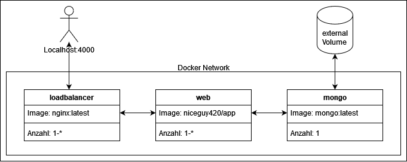

# How to use:

Es muss Docker und Docker-compose (Enthalten in Docker Desktop für Windows) installiert sein.

Zum Starten (Bei ersten Start existiert mongodb_data noch nicht, erstelle das Volumen mit ``$ docker volume create --name=mongodb_data`` ):

 ``docker-compose up``

Zum Beenden:

``docker-compose down``

Der Webservice ist nun auf Localhost:4000 erreichbar.

# Motivation

Ich möchte den Umgang mit Docker lernen und stelle mir deshalb mit Absicht eine einfache Aufgabe, die ich selber schon mehrfach mit verschiedenen Technologien umgesetzt habe. Dadurch lerne ich Schritt für Schritt Features von Docker kennen. 

Diese Aufgabe ist ein einfach Webservice, der einem erlaubt Einträge in eine Datenbank zu speichern sowie diese auslesen zu können.  Diese Aufgabe verlangt eine Vielzahl an unterschiedlichen Voraussetzung wie zum Beispiel Networking, Volumes und Dependecies, die ich alle managen muss. Dadurch sollte ich einen umfangreichen Einblick in Docker erlangen.

# Definition Problemstellung

Mein Ziel ist es eine klassische Webanwendung (Einfache Site mit einem Post auf eine Datenbank) mithilfe von Docker in verschiedene Container aufzuteilen um diese dann mit Docker compose zu managen und zu skalieren. In der Theorie sollten mehrere Webservices zu besserer Performance bei vielen Anfragen an den NodeJS-Server führen. Zudem sollte der Traffic gleichmäßig verteilt werden.

Ich möchte zum Schluss ein Netzwerk, in dem die einzelnen Container von der Außenwelt abgeschnitten sind, jedoch untereinander unbeschwert kommunizieren können. Zudem wollen wir nur einen Eintrittspunkt von außen haben, d.h. nur ein Port wird nach außen hin freigegeben. Dafür benötigen wir einen Loadbalancer, der den eingehenden Verkehr nach einem geeignetem Schema auf die einzelnen Webserver verteilt.

# Lösungsansatz

Folgende Schritte setzten die Grundlage des Projektes:

1. Erstellen eines NodeJS Servers in einem Docker-Container
2. Erstellen und anbinden einer MongoDB als eigener Container
3. Erstellen eines Loadbalancers um den Traffic zu managen
4. Hochskalieren des Webservices      

# Implementierung + Schwierigkeiten

### NodeJS Server

Der NodeJS Container meines Projektes ist, im Gegensatz zu den anderen Images, eine angepasste Version vom Base-Image Node:18.

Die dazugehörige Dockerfile:

```dockerfile
    FROM node:18
    # definiert working dir
    WORKDIR /app
    # deletes all previous data in folder (stops caching)
    RUN rm -rf /app
    # copys nodejs sourcecode into app
    COPY app /app
    # installs dependencies
    RUN npm install
    # exposes Port 5000 in docker standard network   
    EXPOSE 5000
    # on startup run startscript
    CMD npm run app
```

Nachdem ich das Node-Image heruntergeladen haben, kopiere ich das ganze App-Verzeichnis hinein. Ich habe manchmal Probleme gehabt das sich meine Änderungen nicht auf den Container überspielt wurden, deshalb lösche etwaige Überreste sicherheitshalber davor. Der npm install Befehl scannt dann die kopierte package.json nach den benötigten Dependencies und installiert diese. Zum Schluss setzte ich eine Umgebungsvariable für den Port und expose diesen. Wenn nun der Container gestartet wird, führt er den npm run app Befehl aus und startet damit den NodeJS-Server.

Die HTML-Seite, die angezeigt wird, besteht grundsätzlich aus drei Elementen: Einem Formular, eine Liste und eine Button. Zusätzlich zeigt die Überschrift noch an von welcher IP innerhalb des Docker-Netzwerks mir die HTML-Seite geschickt hat.

Mit dem Formular kann man Einträge in die Liste machen. Sie zeigt auch welche IP den GET-request bearbeitet hat. Dies ist meist nicht die gleiche wie die in der Überschrift (Http-GET request wird vom Loadbalancer im Round-Robin-Verfahren direkt auf den nächsten NodeJS-Server weitergeleitet. Dieser speichert dann den Eintrag und leitet dann wieder auf einen NodeJS-Server weiter wenn dies abgeschlossen ist). Der Crash-Button beendet den NodeJS-Server mit dem exit signal 1. Er dient zum Testen des nginx loadbalancer.

### MongoDB

Im Gegensatz zum NodeJS-Image müssen wir am standart MongoDB-Image nichts ändern. Wir verbinden uns in der NodeJS-Applikation einfach mit der Datenbank und können nun sehr einfach Daten ein- und auslesen. Mongoose hilft dabei enorm und vereinfacht diesen Schritt.

```javascript
mongoose.connect( 'mongodb://mongo:27017/web', { useNewUrlParser: true } )

.then(() => console.log('MongoDB Connected'))

.catch(err => console.log(err));
```

Beim ersten Start des Projektes sollte das Volumen mongodb_data noch nicht existieren.

Mit ``$ docker volume create --name=mongodb_data`` wird das Volumen erstellt und mein MongoDB-Container nutzt dieses dann um seine Daten persistent abzulegen. Auch nach dem zerstören oder Neustart des ganzen Networks bleiben die Daten erhalten.

### Nginx

Wenn ich mehrere Instanzen des Webservice starten möchte wäre es enorm nervig wenn ich für jeden einzelnen einen eigenen Port freigeben müsste. Man kann zwar bei der Docker-compose-file eine Range an Ports angeben, aber auch das ist nicht unendlich skalierbar und auch nervig. Deshalb nutzen wir einen Loadbalancer. Er leitet unsere Anfragen an einen NodeJS-Service weiter (standartmäßig mit dem Round-Robin-Verfahren). Dabei nimmt uns Docker auch wieder Arbeit ab, da wir keine genaue IP-Adresse für die Services angeben müssen sondern einfach nur http://web:port ansprechen müssen. Docker weiß dann automatisch das es sich um die Adressen der mehrfach ausgeführten Instanzen handelt. 

Nginx.conf:

```nginx
user nginx;

events {
  worker_connections 1000;
}
http {
  upstream webservice {
  server web:5000 fail_timeout=30s;
  }

server {
    listen 4000;
    location / {
      proxy_pass http://webservice;
    }
  }
}
```

Sollte eine dieser Adressen aus irgendeinem Grund nicht erreichbar sein, verhängt mein Loadbalancer einen 30 Sekunden Timeout. Leider testet er dies nur wenn ein User aktiv versucht diese Adresse zu erreichen.

Es gibt eine Möglichkeit die Verbindung separat und in regelmäßigen Abständen zu testen, dies ist leider aber nur mit einer Nginx-Subscription möglich. Deshalb konnte ich das leider nicht umsetzten.

Ich habe vor Nginx mit HAproxy herumexperimentiert aber durch einen Fehler in der Portverteilung hat dieser nicht funktioniert und als ich diesen Bug gefunden hatte, hatte ich schon meine Versuche mit Nginx begonnen. Ob es bei HAproxy die Möglichkeit für aktive Health Checks gibt, habe ich nicht nachgeschaut.


### Docker-Compose

```yaml
services:

  mongo:
    image: mongo:latest
    volumes:
      - type: volume
        source: mongodb_data
        target: /data/db

  web:
    image: niceguy420/app:latest
    restart: always
    build: .
    # to start db before web
    depends_on:
      - mongo
    scale: 5

  loadbalancer:
    image: nginx:latest
    volumes:
      # copies config into volume and mounts it to etc/nginx as read only
      - ./nginx.conf:/etc/nginx/nginx.conf:ro
    depends_on:
      - web
    ports:
      - "4000-4001:4000"
    scale: 2

volumes:
  mongodb_data:
    external: true
```

In meiner Docker-compose.yml definiere ich drei verschiedene Services. Als erstes definiere ich den Datenbank-Service, der aus dem image mongo generiert wird. Zudem definiere ich noch ein Volume für den Speicherort meiner Datenbank. Zum Schluss definiere ich das Volume mongodb_data als external also als persistent auch nach dem Zerstören des Mongocontainers.

Mein zweiter Service ist der NodeJS-Server. Er wird aus dem Image von meinem DockerHub gebaut. Zudem starten meine Web-Instanzen erst wenn der MongoDB Service gestartet ist (depends_on: mongo). Mit Scale:  gebe ich die Nummer an Instanzen von Web an, die ich am laufen haben will. Dies ist nicht dynamisch, das heißt sollte einer dieser Service abstürzen wird kein Neuer gestartet. Deshalb sage ich mit restart: always das er den Service bei Absturz neu starten soll.

Mein letzter Service, den ich definiere, ist der Loadbalancer. Dieser Service wartet bis alle Webservices gestartet sind, kopiert sich seine nginx.conf und leitet dann den Verkehr von Localhost:ports auf die Adressen der einzelnen Web Services weiter. Auch hier kann ich hochskalieren aber im Gegensatz zum Webservice muss hier für jeden Loadbalancer ein Port freigegeben werde, d.h. sollte die Anzahl der Ports der Hostmaschine nicht mit der Scale-Nummer übereinstimmen gibt es Probleme. Sollte die Portrange des Hostsystems größer sein als die Scale-Nummer kommt es auch zum Fehler. Warum das so ist, ist mir nicht klar.

### Allgemeine Schwierigkeiten:

1. IO-Timeout beim docker-compose up.

    Abbruch und Neustart löst das Problem kurzfristig, jedoch kostet mich das beim häufigen hoch und runterfahren des Netzwerks viel Zeit. Leider ist die Fehlermeldung sehr allgemein, was dazu geführt hat, das ich keine Lösung finden konnte.

2. Imagegröße des Webcontainers. 

   Die zwei Gigabyte Imagegröße ist meiner Meinung nach zu groß. Leider muss ich für NodeJS, Express, Bootstrap, etc viele Module downloaden und ich wüsste nicht (Außer ein redesign meiner Website) wie ich die Größe dieser Module verkleinern könnte. 

# Bewertung anhand Konzepte aus der Vorlesung

Docker nimmt einem selber sehr viel Arbeit ab. Die Dockerfile erleichtert einem die Konfiguration und mit docker-compose.yml lässt sich die Orchestrierung von mehreren Container sowie deren Skalierung auch einfach bewältigen. Zudem lässt sich Ausfälle naiv lösen (mit der Restart-Flag), jedoch ist dies alles statisch und somit vielleicht nicht die beste Lösungen um Ausfälle zu erkennen und zu bearbeiten.

Es ist auch ein beruhigendes Gefühl zu wissen, dass unabhängig von meinem System meine Anwendung sich immer gleich verhält. Das tun VMs auch jedoch fand ich den Umgang mit z.B. Virtualbox langsam und sperrig. Docker ist schnell, lässt mich bei einem Fehler schnell den Container abschießen und ihn neu aufbauen. 

# Erkenntnisse, Fazit, nächste Schritte

### Erkenntnisse:

1. Docker Container eignen sich perfekt um kleine Dinge auf verschiedenen Versionen, mit verschiedenen Umgebungen oder ähnlichem automatisiert zu testen
2. Docker Compose eignet sich für statische Netzwerke aus Container, besitzt aber keine Features um das laufende Netzwerk effektiv zu überwachen, dynamisch zu skalieren oder zu managen.
3. Networking innerhalb des Docker-Standard-Netzwerks ist einfacher als gedacht und bei Bedarf können Verbindungen zwischen einzelnen Container noch zusätzlich konfiguriert werden.
4. Schon fertige Images von DockerHub erleichtern einem stark die Arbeit.

### Fazit

Docker und Docker-Compose sind mächtige Tools um speziell angepasste Umgebungen schnell und vor allem automatisiert zu erstellen. Docker Container sind leichtgewichtig und beschleunigen somit das erzeugen und zerstören dieser Umgebungen was wiederum den Entwicklungs- und Testprozess beschleunigt. 

### Nächste Schritte:

Mit Docker Swarm könnte ich meine Services dynamisch und vorallem live managen. Zudem würde ich zu gerne mein System auslasten und die Performance auslesen. Dafür bräuchte eine Form von Bot die meine Anfragen an den Webservice automatisiert. Ob dies überhaupt auf meiner lokalen Maschine läuft, weiß ich nicht.

Zudem würde ich mich, wenn ich an diesem Projekt weiter arbeiten sollte, gerne mehr mit "warum/wann sollte ich skalieren" beschäftigen als mit "wie skaliere ich". 

Auch eine Hochskalierung der Datenbank, vor allem bei einer Anwendung wo lesen und schreiben häufig vorkommt, wäre auch ein Schritt der getan werden könnte. Die Skalierung an sich ist einfach, jedoch müssen sich die einzelnen Datenbank untereinander austauschen, aber beim Zugriff auf ein Volume, was ich zum Datenaustausch nutzen würde, wird dieses locked und somit für die anderen unzugänglich. 

Zu aller Letzt bin ich unzufrieden mit dem Aussehen und manchen Implementierungsproblemen meine Website. Da existiert auf jeden Fall noch Platz nach oben sollte aber natürlich nicht der Fokus dieses Projektes sein.

# Architekturschaubild


# 

# Sourcecode

DockerHub Repository: 

​	niceguy420/app 

Github Repository:

​	https://github.com/MathisRebelHft/CC-Projekt.git


# Tätigkeitsnachweis

|Datum | Zeit | Task |
|------------ | -------------| -------------|
|02.06 | 2:30h | Dockerdoku, Docker Tutorials (bradtravesty, pspd) |
|06.06 | 3:00h | Docker Tutorial (openlib), erster eigener Versuch mit Docker |
|07.06 | 3:30h | NodeJS Prototype ohne db, frontend html (ejs) |
|08.06 | 5:00h | Umwandlung NodeJS in Container, MongoDB Container, haproxy Versuch  |
|09.06 | 2:30h | Nginx Loadbalancer |
|10.06 | 4:30h | Docker scale, package.json bug, Verbindung DB mit web, caching probleme |
|11.06 | 4:30h | webanwendung skaliert, web schön? gemacht, auto update |
|12.06 | 3:00h | Docker Swarm Exkurs |
|13.06 | 1:30h | Dokumentation ausarbeiten |
|14.06 | 3:30h | Loadbalancer healthchecks aktiv/passiv, crash button|
|15.06 | 1:30h | Doku überarbeitet |
|17.06 | 1:00h | Doku Schaubild, Rechtschreibcheck |
|18.06 | 3:30h | Code Cleanup, Doku Cleanup, Nginx dockerhub push bug |
|19.06 | 2:00h | Präsentationsprobe, clean up |
